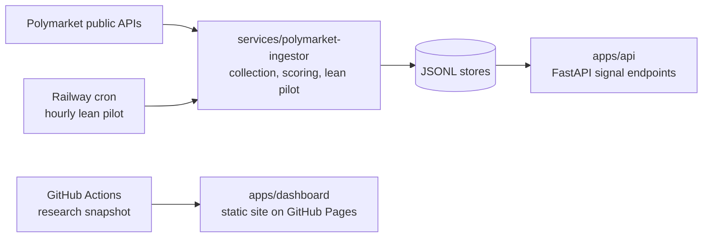

# MarketSignalOS

Can you find Polymarket wallets whose trading shows real forecasting skill, and
would following them have been worth it after costs? MarketSignalOS collects public
Polymarket wallet history, scores each wallet with a Bayesian model of its edge over
the market's own prices, and only surfaces a wallet once it passes 13 evidence
gates: data coverage, sample size, economics, recency and closing-line value.

**Result so far: no wallet qualifies, and the reasons are documented.** On the
833-wallet snapshot from June 2026, zero wallets passed every gate. The follow-up
work showed why the question could not be answered on that snapshot. Closing-line
value, one of the gates, needs a market's price shortly before it closes, and the
snapshot held only about 1.5 days of prices against 4.5 years of trades. A live
probe then recovered hourly closing prices for all 40 sampled markets that closed
in 2023 or later. Collection is restarting in the cloud; feeding those prices into
the closing-line gate is the next versioned change. Observed trading is not proof
of skill, and nothing here is investment advice.

- **Dashboard:** a static research page on GitHub Pages that reads a snapshot of
  public trades refreshed every six hours by GitHub Actions.
- **Research plan and evidence:** [docs/handoff-blueprint.md](docs/handoff-blueprint.md)
  is the staged plan, each stage with an entry gate and acceptance evidence.
  Dated evidence lives in [docs/benchmarks/](docs/benchmarks/), for example:
  - [why zero wallets qualify](docs/benchmarks/2026-09-10-gate-attrition.md);
  - [the prior-variance diagnostic](docs/benchmarks/2026-09-28-prior-floor.md);
  - [closing prices are recoverable](docs/benchmarks/2026-09-29-price-history-probe.md);
  - [reading trades from the Polygon chain](docs/benchmarks/2026-09-29-polygon-logs-probe.md).

## How it works



- **Skill model.** Each resolved bet is compared with the price the wallet paid:
  `logit(q) = logit(p) + edge`. A wallet's edge is fit against a population prior
  and discounted for bets on the same event, so a lucky streak on one event is not
  read as skill. See
  `services/polymarket-ingestor/src/marketsignalos_polymarket/skill_computation.py`.
- **Gates, not rankings.** A wallet is tailable only if every gate passes, and each
  failure is recorded with its reason. Loosening a gate to fill an empty feed is
  explicitly out of bounds.
- **Budget.** The whole system targets $15 a month: the website and snapshot
  collection are free, and the only paid piece is one small scheduled worker on
  Railway.

## Repository layout

| Path | What it is |
|---|---|
| `apps/api` | FastAPI app serving signals, wallet dossiers and operator routes |
| `apps/dashboard` | React/Vite dashboard; the static build is what GitHub Pages serves |
| `services/polymarket-ingestor` | Ingestion, Bayesian skill scoring, closing-line backfill, lean pilot, Polymarket→Kalshi matcher |
| `deploy/`, `railway.toml` | Worker image and Railway cron config for the lean pilot |
| `scripts/` | Research-snapshot collection and the live probes behind the evidence docs |
| `evals/market_matching` | Hand-labelled eval set for the market matcher |
| `docs/` | Blueprint, evidence, ADRs, runbooks; `CLAUDE.md` is the developer guide |

## Development

Requires Python 3.13 with [uv](https://docs.astral.sh/uv/), and Node 24 with pnpm 10.

```sh
uv sync --frozen
uv run --no-sync pytest -q
uv run --no-sync ruff check apps/api services/polymarket-ingestor scripts
uv run --no-sync mypy apps/api services/polymarket-ingestor scripts --config-file pyproject.toml

pnpm install --frozen-lockfile
pnpm --filter @marketsignalos/dashboard run test
pnpm --filter @marketsignalos/dashboard run dev
```

CI runs all of this on every pull request (Python on Linux and Windows). See
[CLAUDE.md](CLAUDE.md) for the full developer guide, API endpoints and conventions.

MIT licensed.
