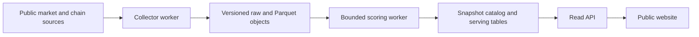

# Cloud separation after storage validation

Status: proposed implementation sequence, prepared for Railway. No resources,
credentials, paid services or live schedules were created by this work.

The current API process owns optional ingestion and fast-lane loops, and API
reads use local JSONL. Moving just that process to a cloud instance moves the
memory bottleneck too. Separate publication of scored snapshots from public
serving so a failed recomputation leaves the last successful snapshot available.

## Service boundaries

- Collector: persist observations, source provenance, checkpoints, completeness
  and errors. Publish an immutable input manifest only after all objects verify.
- Scorer: consume one named input snapshot and code version. Write derived data
  into a new version, validate counts and quality, then publish atomically.
- Serving database: retain completed snapshot versions and a pointer to the
  current version. The API reads a consistent version; it never performs a full
  activity scan in a request or exposes an in-progress score rewrite.
- Public API and website: show source time, score time, coverage, score version
  and stale status. Operator mutations require authentication and a separate
  authorization boundary. In-process collection is disabled after worker cutover.

Postgres is a reasonable initial catalog and serving target because this repo
already has an optional Postgres write path. API reads still need an explicit
adapter and parity tests before switching. Raw history remains independently
rebuildable from object storage.

## Railway constraints checked on 2026-09-08

Railway volumes are attached to services, do not support replicas, and can
introduce deployment downtime. Treat a worker's volume as its own scratch or
checkpoint storage; exchange completed snapshots through object storage and
the catalog. See [volume limitations](https://docs.railway.com/volumes/reference).

Railway offers private S3-compatible buckets. Its documentation currently lists
object versioning, object locks and lifecycle configuration as unsupported.
Our proposed content-addressed keys and manifest checks would therefore be
application controls, not provider-enforced retention. Include a separate backup
and restore test. Bucket pricing also differs from service upload egress; measure
both before approving a budget. See [storage buckets](https://docs.railway.com/storage-buckets).

A Railway scheduled service must exit. A still-running execution causes the next
scheduled execution to be skipped; the platform does not automatically terminate
it. Configure a worker deadline and durable run status, and choose a schedule
from measured runtime and data-freshness needs. See [cron behavior](https://docs.railway.com/cron-jobs).

## Next implementation increments

1. Define a snapshot catalog with dataset ID, source/observation interval, schema
   and scorer versions, file checksums, row counts, coverage, run state and error
   reason. Add a unique run key and a lease so retries cannot publish twice.
2. Implement local snapshot publication first: upload/write objects under a new
   version, verify them, and commit the manifest last. Inject failures before
   and after publication, retry safely, and restore a previous version.
3. Add an explicit worker entry point that consumes the catalog and exits.
   Measure the largest wallet/bucket under a hard container memory limit. Reduce
   materialization if the memory budget is too small; merely changing storage
   formats cannot cap Python scoring memory.
4. Publish derived rows and switch the serving pointer in one database
   transaction. Run old/new API response comparisons on a frozen snapshot.
   Keep the previous pointer available for rollback; never relabel it as fresh
   after a failed run.
5. Prepare a Railway staging deployment with private database access, separate
   worker and serving budgets, authenticated monitoring, restart tests and an
   alert-delivery test. Present measured storage, compute and transfer usage
   before paid provisioning or production cutover.

## Research acceptance

Storage parity proves that a migration preserves the existing computation.
A public claim of predictive advantage also requires the prospective protocol
in [research-credibility.md](research-credibility.md): frozen selection, later
unseen outcomes, executable follower prices, costs, dependence handling and
multiple-comparison controls. Keep that acceptance gate separate from deployment.
