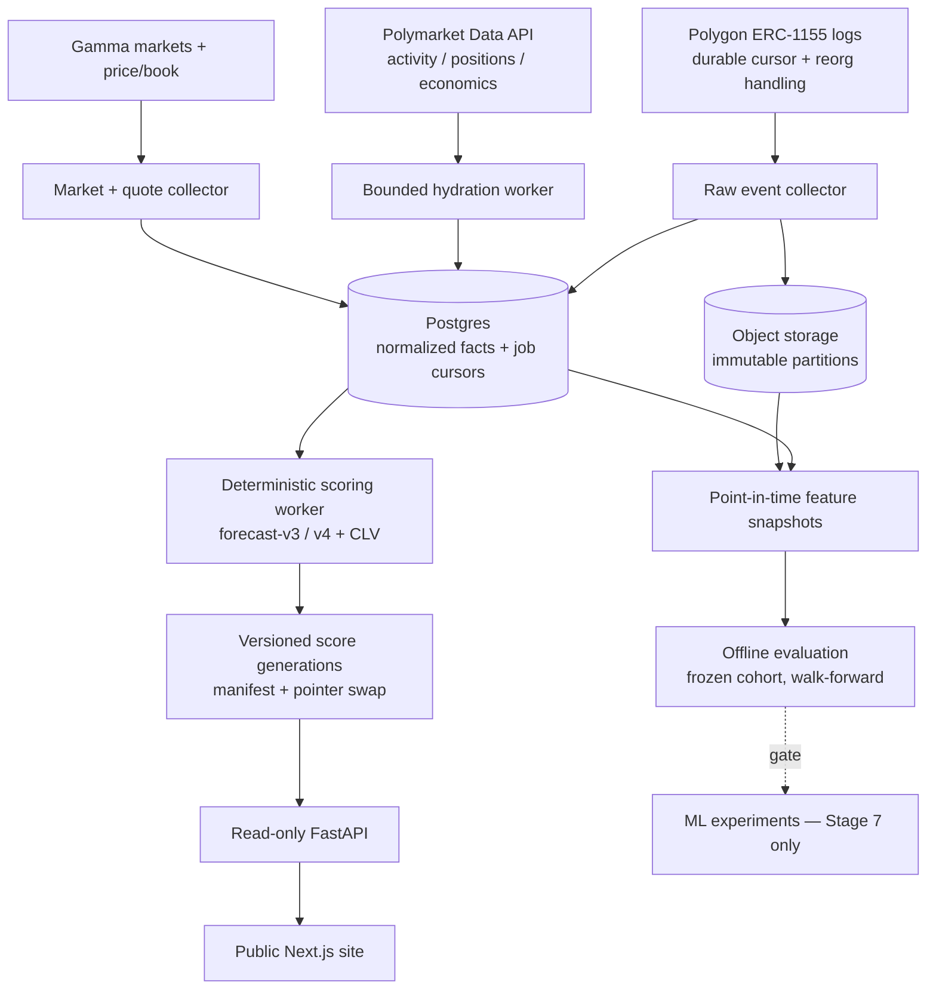

# MarketSignalOS — Engineering Handoff Blueprint

**Status:** authoritative build reference. Supersedes the "+EV Polymarket Analytics
Engine" handoff blueprint (Celery/Redis/PyTorch/WebSocket architecture). Where this
document and any older plan disagree, this document wins.

**Written:** 2026-09-10, against `main` @ `a90d81b` and `codex/lean-pilot-15-budget`
@ `8fda2e2`. Every "as of today" number below was verified by running the code, not
read from a summary.

**How to use this.** Stages run in order. Each stage has an **entry gate** — a
condition that must already be true — and **acceptance evidence** — an artifact a
reviewer can inspect to confirm the stage is done. Do not start a stage whose entry
gate is unmet. Do not declare a stage done without producing its evidence file. If a
stage's evidence contradicts this document, update this document in the same commit.

**Companion documents.** `docs/research-credibility.md` (evidence standards),
`docs/platform-roadmap.md` (target architecture), `docs/lean-pilot.md` (budget
worker), `docs/storage-benchmark.md` and `docs/enrichment-shadow.md` (storage
evidence) currently exist **only on `codex/lean-pilot-15-budget`**. Merging that
branch is a prerequisite for Stage 1.

---

## 1. Thesis

MarketSignalOS is a **public research instrument**, not a trading system. It answers
one question:

> Does a frozen, pre-declared rule for selecting Polymarket wallets identify future
> positions that beat a price-based baseline **after realistic follower costs**?

Everything else — the dashboard, the leaderboard, the ledger, the fast lane, the
metrics stack — exists to make that question answerable and the answer auditable. A
well-measured **null result is a successful outcome** of this project. A saturated
score with no prospective validation is a failure, however good the dashboard looks.

Two claims this system will never make: that it has identified insider trading, and
that a wallet's skill probability is the probability its next trade wins. Both are
unprovable from the available data and both are already prohibited in `CLAUDE.md`.

---

## 2. Ground truth as of 2026-09-10

Verified by checking out `codex/lean-pilot-15-budget` and running the suites.

| Check | Result |
|---|---|
| `apps/api` ruff + `mypy .` (CI-equivalent) | clean, 50 files |
| `services/polymarket-ingestor` ruff + `mypy src` (CI-equivalent) | clean, 19 files |
| `apps/web` `npm ci` → `lint` → `build` | exit 0 |
| `pytest apps/api services/polymarket-ingestor` | 518 passed, 11 failed, 6 errors |
| Repo-root `mypy .` (documented in `CLAUDE.md`) | **7 errors on branch, 0 on `main`** |

All 17 test failures share one root cause: `activity_parquet.connect()` sets DuckDB's
`TimeZone` option, which requires the `icu` extension, which DuckDB autoloads over
HTTP from `extensions.duckdb.org`. Any environment without egress to that host fails
closed. See §11.

### The blocking discovery

`docs/benchmarks/2026-09-08-enrichment-shadow.md` reports, on a frozen 16.9M-observation
snapshot covering 2022-01-06 → 2026-06-12:

- 833 wallets scored
- **125 trusted, 708 untrusted**
- **701 flagged "incomplete market metadata"**
- 799 fail "conservative edge is not positive"
- 632 have fewer than 10 closing-line observations
- **0 wallets qualify as tailable**

Read `skill_computation.py:586-638` before interpreting that. Tailability is a
conjunction of thirteen conditions, and it opens with:

```python
tailability_reasons = list(data_reasons)   # skill_computation.py:606
```

`data_reasons` holds six **data-completeness** flags, one of which is
`hydration.metadata_coverage < 1.0`. So a wallet with incomplete market metadata is
blocked from the feed **regardless of its measured skill**. The model is never
consulted for it.

**Therefore: 701 of 833 wallets (84%) are mechanically excluded by coverage before
any question of alpha arises.** The effective skill-eligible population on your best
available data is **125 wallets**, not 833. "Zero wallets qualify" is, for the large
majority, a *coverage artifact*.

This single fact reorders the entire plan. The previous four development passes
(observability, Grafana delivery, storage benchmarking, budget worker) built delivery
infrastructure for a signal whose absence has not been established — because the
measurement that would establish it is blocked by a data-completeness bug, not by the
model.

### The full gate list

For Stage 0 you need these by name. All thirteen must pass for `tailability_status ==
"tailable"` (`skill_computation.py:586-638`):

| # | Gate | Source | Kind |
|---|---|---|---|
| 1 | `activity_history_complete` | hydration | data |
| 2 | `positions_complete` | hydration | data |
| 3 | `closed_positions_complete` | hydration | data |
| 4 | `economic_all_time_complete` | hydration | data |
| 5 | `economic_month_complete` | hydration | data |
| 6 | `metadata_coverage >= 1.0` | hydration | data |
| 7 | `ess >= 20.0` | lifetime fit | model |
| 8 | `posterior_skill >= 0.80` | lifetime fit | model |
| 9 | `edge_lower_bound > 0.0` | lifetime fit | model |
| 10 | `all_time_pnl > 0` and `all_time_roi > 0` and `pnl_30d >= 0` | economics | economic |
| 11 | `recent_ess >= 5.0` (`MIN_RECENT_INDEPENDENT_EVENTS`) | recency fit | model |
| 12 | `recent_fit.edge_mean >= 0.0` | recency fit | model |
| 13 | `clv_sample >= 10.0` (`MIN_CLV_SAMPLE`) and `clv_lower_bound > 0` | CLV | model |

Gates 1–6 are **fixable by engineering**. Gates 7–13 are **findings about the world**.
Conflating them is what produced the current situation.

---

## 3. Invariants

These hold at every stage. A change that violates one is wrong regardless of what it
enables.

1. **Never loosen a gate to populate the feed.** An empty feed is a result. A feed
   populated by moving a threshold is a lie with a UI. If a gate is wrong, change it
   because a *diagnostic* showed it was miscalibrated, in its own commit, with the
   before/after cohort counts recorded.
2. **Raw observations are append-only and immutable. Derived scores are versioned and
   disposable.** You must be able to delete every score and rebuild it. You must never
   be able to overwrite an observation.
3. **Everything is bitemporal.** Every stored row carries `event_time` (when it
   happened) and `observed_time` (when you learned it). Point-in-time reconstruction is
   impossible without both, and without point-in-time reconstruction no evaluation
   and no ML is valid. This is the single most important schema rule in this document.
4. **Deterministic before probabilistic.** Every score must be reproducible bit-for-bit
   from the same inputs and a recorded code hash. `score_snapshot.py` already enforces
   this for the two derived files; extend the contract, don't weaken it.
5. **Separate "computation completed" from "inputs are fresh" from "coverage is
   complete."** A successful scoring run says nothing about whether the data under it
   was current or whole. `platform_status.public_status()` already distinguishes these;
   keep them distinct everywhere.
6. **Non-accusatory language, enforced at the type level where possible.** "observed
   wallet", "historical forecasting evidence", "systematic trading pattern". Never
   "sharp", "insider", "alpha trader" in schema, API, or UI. Naming a mechanism you
   cannot observe makes you stop measuring the one you can.
7. **Follower economics, not wallet economics.** Every EV number is computed at the
   price a follower could actually transact at, on the executable side of the book,
   after delay and fees. The wallet's own PnL is a different quantity and must never
   be presented as the tail's expected return.
8. **One writer per data directory.** JSONL append/index/checkpoint writes are not one
   transaction. Until Stage 6, exactly one process writes at a time, enforced by an OS
   lock. This is why `lean_pilot.worker_lock` exists.
9. **Budget targets are allocations, not caps.** Nothing in this repo configures a
   billing limit. Never describe a design target as a cost guarantee.

---

## 4. Corrections to the original blueprint

Recorded with reasons, because a plan that states the right design without recording
why the obvious-looking design is wrong will be "improved" back into the wrong design.

### 4.1 The consensus fair-value formula is dimensionally wrong — do not build it

The original blueprint proposed:

```
P_model = Σ(Balanceᵢ × E[θᵢ]) / Σ Balanceᵢ ,   where E[θᵢ] = αᵢ / (αᵢ + βᵢ)
EV      = (P_model × Payout_net) − (1 − P_model)
```

`E[θᵢ]` is a **wallet-level skill rating** on [0,1] — how often wallet *i* is right.
`P_model` is supposed to be **P(this specific outcome resolves YES)**. A balance-weighted
average of skill ratings is not that quantity.

Concretely: if every wallet holding a contract has `E[θ] = 0.66`, the formula returns
a fair value of 66¢ whether the market trades at 5¢ or at 95¢, and whether they hold
YES or NO. It ignores the price entirely. Fed into the EV formula it produces confident
nonsense at both tails, and it produces it most confidently exactly where mispricing
claims are least plausible.

**Build this instead** — and note it already exists in
`apps/api/src/marketsignalos_api/services/skilled_bets.py:344`:

```python
fair_price = sigmoid(logit(entry_price) + tail_edge)
tail_ev    = fair_price − executable_price
```

The difference is structural: the correct construction starts **from the market price**
and applies a measured, bounded shift to it. The market price is the strongest single
predictor available and the model's job is to say how far a specific wallet's entry
should move it — not to replace it. Any future fair-value work must preserve this
property: *no estimator that can return a price without reading a price.*

### 4.2 Model-weighted Bayesian updates destroy the interval — do not build them

The original blueprint proposed scaling the Beta-Binomial evidence counts by a neural
model's confidence:

```
α_updated = α₀ + (w_m · I_early_entry)
β_updated = β₀ + (w_m · I_incorrect)
```

The reason to have a Bayesian layer at all is that its credible interval means
something: it tells you how much you should distrust a small sample. Multiplying the
evidence counts by an unvalidated model's output makes the posterior variance a
function of that model. You now have an interval whose width you cannot interpret, and
you have coupled your only calibrated component to your least calibrated one.

**What is already implemented and is the correct treatment of the same underlying
problem** (`skill_computation.py:23-30`, `bayesian_skill.py`):

```
y_i ~ Bernoulli(q_i),   logit(q_i) = logit(p_i) + edge_w
edge_w ~ Normal(mu_pop, sigma2_pop)          # empirical Bayes across wallets
skill_likelihood = P(edge_w > 0 | data)
```

where `p_i` is the market-implied probability at the wallet's volume-weighted entry.
The real threat to this posterior is not miscalibrated confidence — it is **correlated
observations**: a wallet's forty fills across one election are not forty independent
tests of skill. That is what `independent_settled_events` (ESS) exists to penalize, and
it is deterministic, explainable, and auditable. Keep it. If you want a model-derived
input, it belongs as a *feature* in a separate scored layer, never as a multiplier on
evidence counts.

### 4.3 Infrastructure the blueprint specified that you should not build

| Blueprint component | Verdict | Reason |
|---|---|---|
| Celery + Redis worker pipeline | **Do not build** | You have one hourly job. Redis alone is ~⅔ of the entire monthly budget. `lean_pilot.py` already provides leases, deadlines, resource guards, and crash accounting in one locked subprocess. Revisit only when you have ≥3 genuinely concurrent job classes with independent retry semantics. |
| Redis feature store | **Do not build** | There is no online inference path and no latency requirement that a file read fails to meet. |
| CLOB WebSocket ingestion | **Defer indefinitely** | Justified only if you are racing execution. You are not: this is a research instrument, and the fast lane's ≥30s HTTP poll is already faster than the decision loop it feeds. |
| PyTorch LSTM / Transformer | **Defer to Stage 7** | Sequence models need point-in-time features (Stage 5) and a validated non-null baseline (Stage 3). Building them earlier guarantees leakage and unfalsifiable results. |
| Sub-100ms REST / WS streams | **Do not build** | At current scale the dashboard is server-rendered with a 10s upstream timeout and nobody notices. Optimizing this is pure cost. |
| "Insider alpha" framing | **Prohibited** | See invariant 6. |

### 4.4 The one thing the blueprint had right that is still missing

**ERC-1155 transfer decoding from Polygon logs.** Not for the ML — for the
**denominator**.

Discovery today is leaderboard-shaped: wallets enter the population *because they
already performed well*. That is textbook survivorship selection, and it makes the
entire cohort uninterpretable no matter how good the Bayesian fit is. You cannot
compute a false-discovery rate without knowing how many wallets you screened, and you
cannot know that from a leaderboard.

A chain-log listener is the only way to observe the losing and inactive wallets. This
is Stage 4, and it ranks **above** the Postgres migration.

### 4.5 Schema errors in the blueprint's DDL

The proposed schema stores **mutable current state** where it must store **immutable
observations**:

- `condition_tokens.current_polymarket_price` — a mutable price column on the token
  row. Updating it destroys the price history that CLV, `move_captured_pct`, and every
  point-in-time feature depend on. You already learned this the hard way: the
  deduplicating markets store discarded history, which is why
  `polymarket_price_snapshots.jsonl` had to be added.
- `wallet_positions.current_balance` + `last_updated_block` — one mutable row per
  (wallet, token). You cannot reconstruct what a position looked like at a past cutoff,
  so you cannot evaluate a frozen cohort, so you cannot run the experiment this system
  exists to run.
- `sharp_wallets.alpha_score_prior/posterior` — mutable score columns. Scores are
  versioned artifacts (model version × input version × as-of cutoff), not attributes
  of a wallet.
- `sharp_wallets` as a table name, and `is_flagged_algorithmic BOOLEAN` — bakes the
  prohibited framing and a false binary into the schema. `trader_style.py` already
  produces a continuous `automation_score` with five explainable driver strings.

Corrected schema in §8.

---

## 5. The mathematical core

Implement nothing here from memory; these are the definitions the code must match.

**Entry price.** For each (wallet, condition_id, outcome_index), `p_i` is the
**buys-only volume-weighted average price**. Buys-only matters: a wallet that fully
exits before resolution must retain its original entry for CLV. See `_Position`
(`skill_computation.py:96`), which keeps `bought_size`/`bought_cost_usdc` separate from
net accumulators.

**Resolved bet.** A position with non-zero `net_size` at resolution. Positions fully
exited before resolution are not bets — they are realized PnL and are scored by CLV
instead.

**Skill fit.** Hierarchical Bayesian logistic edge, fit jointly across all wallets in
one enrichment pass:

```
logit(q_i) = logit(p_i) + edge_w
y_i ~ Bernoulli(q_i)
edge_w ~ Normal(mu_pop, sigma2_pop)        # empirical Bayes, prior clamped
```

`edge_w` is an additive shift in **log-odds**, which is why it composes with any entry
price without leaving [0,1]. Outputs: `edge_mean`, `edge_lower_bound` (conservative),
`posterior_skill = P(edge_w > 0 | data)`.

**Effective sample size.** `independent_settled_events` down-weights bets sharing an
event so correlated fills cannot inflate confidence. This is the load-bearing defense
against the most common failure mode in this entire domain. Any change to it requires
a written justification in `docs/fix-lessons-learned.md`.

**Recency fit (`forecast-v3`).** The same fit with likelihood weights decayed at a
180-day half-life anchored to the newest bet in the dataset. Gates 11–12.

**Category fit (`forecast-v4`).** Partial-pooling refit per Gamma category using the
wallet's lifetime posterior as prior. A category with ≥5 independent events caps
`tail_edge_used`; a thinner one falls back to the wallet-level score.

**Closing-line value.** Event-capped, capital-weighted mean of
`(closing_or_current_line − buys_only_entry_VWAP)`. Resolved markets count only when a
pre-close price observation exists. CLV is the cleanest mechanism-independent evidence
of edge because it does not require resolution and does not depend on the wallet being
right — only on the market moving toward the wallet's entry. This is why it *gates*
tailability rather than decorating a row.

**Tail fair value and EV.**

```
tail_edge      = min(lifetime edge_lower_bound, category edge_lower_bound if proven)
tail_fair_price = sigmoid(logit(entry_price) + tail_edge)
executable_price = ask           if the Gamma book is known      → tail_ev_source="ask"
                 = 1 − bid       for a NO-side tail
                 = mark          otherwise                        → tail_ev_source="mark"
tail_ev        = tail_fair_price − executable_price               # $/share
```

`_TAIL_EV_MARGINAL_BUFFER = 0.02` separates `positive` from `marginal`. Rows rank by
`tail_ev` **within** each `remaining_edge_status` tier, never across tiers.

**What is still missing from the EV number, and must be added before any performance
claim** (Stage 3): entry delay between wallet fill and follower fill, slippage at
realistic size, Polymarket fees, and an explicit exclusion policy for observations with
no executable quote. Missing quotes must be **excluded with a recorded reason**, never
imputed as zero cost.

---

## 6. Stage plan

Each stage: **Question → Entry gate → Build → Acceptance evidence → Non-goals.**

---

### Stage 0 — Diagnose the gate attrition

**Question.** Of the thirteen tailability gates, which ones are actually binding, and
is the empty feed a coverage artifact or a finding about alpha?

**Entry gate.** None. Start here. This is an afternoon of work on data you already
have and it determines whether any later stage is worth doing.

**Build.** A diagnostic command — `marketsignalos_polymarket.gate_attrition` — that
reads a frozen snapshot and emits a **waterfall**: starting from N wallets, how many
survive each gate applied cumulatively in the order of §2, and how many fail each gate
in isolation. Emit both orderings; the cumulative one shows what is binding, the
isolated one shows what is fixable.

Then run three counterfactual passes, **as diagnostics only, never shipped**:

1. Data gates (1–6) suspended. How many wallets clear gates 7–13?
2. Gate 6 (`metadata_coverage`) alone suspended. Isolates the 701.
3. Gate 13 (CLV sample ≥10) relaxed to 5. Tests whether the CLV gate is calibrated for
   a sample size your coverage cannot currently produce.

**Acceptance evidence.** `docs/benchmarks/<date>-gate-attrition.md` + `.json`, with the
waterfall table, the three counterfactual counts, the frozen snapshot's SHA-256, and a
one-paragraph conclusion naming which of these three worlds you are in:

- **(A) Coverage-bound** — data gates dominate; the model has not been tested.
  → Stage 1 is the whole job.
- **(B) Calibration-bound** — data gates suspended, wallets still fail 7–13 narrowly
  and in a patterned way (e.g. everyone fails only gate 13). → One gate is calibrated
  for a sample size you don't have; fix that gate specifically, with this evidence
  cited in the commit.
- **(C) Signal-absent** — data gates suspended, wallets fail 7–13 broadly and by wide
  margins. → The population genuinely has no measurable edge under this model. Go
  straight to §10, kill criteria.

**Non-goals.** Do not change any threshold in this stage. Do not deploy anything. Do
not touch the feed. The output is a document, not a code change.

---

### Stage 1 — Close the coverage blocker

**Question.** Can `metadata_coverage` reach 1.0 for the wallets you care about, and if
not, is a hard `< 1.0` block the right semantics?

**Entry gate.** Stage 0 concluded (A) or (B). If (C), skip to §10.

**Build.**

1. Merge `codex/lean-pilot-15-budget` after clearing the defects in §11. Its bounded
   collection controls are prerequisites for everything below.
2. Instrument *why* `metadata_coverage < 1.0`: which condition_ids referenced by
   activity have no row in `polymarket_markets.jsonl`, and why the backfill missed
   them (never fetched / Gamma 404 / category absent / pagination cap). Emit counts by
   reason — you cannot fix a coverage number you cannot decompose.
3. Fix the largest reason bucket. The known candidate is `/positions` pagination
   capping at ~100 per wallet (already listed as pending in `CLAUDE.md`), which
   silently truncates large wallets — exactly the wallets most worth scoring.
4. **Reconsider the semantics.** A hard block at `< 1.0` means one unresolvable market
   in a 4-year history permanently disqualifies a wallet. Consider a graded contract:
   coverage ≥ some threshold with the uncovered fraction *excluded from the fit and
   reported*, rather than the wallet excluded from the product. If you make this
   change, it must be justified by the Stage 0 waterfall and land in its own commit
   with before/after cohort counts. This is the one gate change this document
   pre-authorizes, and only on that evidence.

**Acceptance evidence.** A re-run of the Stage 0 waterfall on the same frozen snapshot
showing `metadata_coverage` failures dropped from 701, with the decomposition-by-reason
table before and after. Trusted-wallet count moves from 125 to a stated number.

**Non-goals.** Do not add new discovery sources here. Do not touch gates 7–13.

---

### Stage 2 — Deploy bounded unattended collection

**Question.** Can collection run for weeks without your laptop, inside a stated budget,
without corrupting its own store?

**Entry gate.** Stage 1 evidence exists. `recovery_required` semantics understood.

Deployment is sequenced here — before evaluation, not after — for one reason: a
prospective evaluation needs a **clock that keeps running**. If collection stops
mid-window the experiment dies and cannot be restarted without a new cutoff. The lean
pilot is the enabler for Stage 3, not a reward for finishing it.

**Build.** Deploy `lean_pilot` as a Railway scheduled worker per `docs/lean-pilot.md`,
with its own volume, separate from the serving API. Before provisioning:

- Resolve the raw-collection restart-safety item the pilot doc names as next: the
  in-memory activity dedupe index does not shrink with wallet batching and is the
  standing OOM risk. Either make it transactional/on-disk or prove the 4 GiB guard
  holds on a real batch — measured, not assumed.
- Define a retention policy. Score generations are ~426 MB each and nothing currently
  deletes them.
- Write and test the recovery procedure for `recovery_required`. There is deliberately
  no automatic repair; there must be a documented manual one.
- Set a Railway alert at $10 and a workspace compute limit at $15, and record in the
  runbook that the hard limit takes *all* workspace workloads offline.

**Acceptance evidence.** `docs/benchmarks/<date>-pilot-live.md`: 14 consecutive days
of receipts with laptop off; measured peak RSS, CPU-seconds, and wall time per cycle
against the 4 GiB / 20-minute / 60-minute-per-day guards; one deliberately killed
worker showing the reservation retained and `recovery_required` set; one successful
recovery; and the **actual Railway invoice line** against the $15 target.

**Non-goals.** Do not switch API reads to the pilot's snapshots yet (that is Stage 5).
Do not enable the API's own scheduler simultaneously — one ingestion owner.

---

### Stage 3 — Freeze cohort v1 and start the prospective clock

**Question.** Does the current selection rule beat baseline going forward?

**Entry gate.** Stage 2 running for ≥14 days with no unexplained gaps.

Run this on the **leaderboard-discovered cohort**, knowing it is survivorship-biased,
and say so in the evidence. The bias runs in a known direction: it inflates apparent
performance. That makes cohort v1 a cheap **upper bound**. If a cohort selected on past
success cannot beat baseline forward, an unbiased one certainly will not — and you
learn that in weeks instead of after building Stage 4. Do not wait for perfect
discovery to start the clock.

**Build.** Per `docs/research-credibility.md`, freeze and commit *before* looking at
any outcome:

- Discovery source, cutoff timestamp, and **every screened wallet** including losers
  and inactives, each with its qualification/exclusion reason.
- Model version, prior version, training interval, exact gate thresholds. Frozen for
  the whole evaluation. Every variant you tried, recorded.
- **One** primary outcome and horizon. Recommended: event-weighted signed price
  improvement over a pre-declared horizon using contemporaneous executable quotes.
  Settlement ROI and calibration are secondary.
- A price-only baseline and a matched comparison cohort selected using only
  information available at the cutoff. State the matching procedure and the residual
  imbalance.
- Follower cost model: entry delay, executable side, size, spread, fees, slippage.
  Wallet PnL kept strictly separate from follower PnL. Non-executable observations
  excluded **with reasons**, never zero-filled.
- Event-cluster resampling, a fixed evaluation date, a censoring policy for unresolved
  events, and a multiple-comparison policy for any per-wallet claim.

The existing `signal_ledger` is the right substrate — it already freezes surface-time
prices and book context per row. Extend it with the cohort ID and the frozen config
hash; do not build a parallel mechanism.

**Acceptance evidence.** `docs/evaluations/cohort-v1/frozen-config.json` committed
**before** the window opens, with its hash recorded in this document. At the evaluation
date, `docs/evaluations/cohort-v1/result.md`: primary outcome with confidence
interval, calibration plot, Brier score, log loss, the ablations (price-only, CLV-only,
historical-edge, combined), and every null and failed variant.

**Non-goals.** No model changes during the window. No gate changes during the window.
No peeking — if you look early, you have a sequential-testing problem and must say so.

---

### Stage 4 — Unbiased discovery via Polygon chain logs

**Question.** What does the whole population look like, not just the winners?

**Entry gate.** Stage 3 window open (this runs in parallel — it feeds cohort v2).

**Build.** The one component from the original blueprint worth building. A Polygon
log listener decoding ERC-1155 `TransferSingle`/`TransferBatch` on the Polymarket
conditional-token contract, with:

- A **durable cursor** (block number + log index), the gap the roadmap names as the top
  discovery deficiency.
- **Reorg handling.** Store block hash; re-scan on divergence; mark superseded rows
  rather than deleting them (invariant 2).
- Bitemporal rows (invariant 3): `event_time` from the block, `observed_time` from
  ingestion.
- Object-storage partitions for raw logs; Postgres for normalized facts and cursors.

Also documented semantics — and tests — for split, merge, redemption, and fee events.
A JSONL→Parquet export of Data API observations is **not** a raw chain archive and must
not be described as one.

**Acceptance evidence.** A wallet census over a stated block interval with the count of
wallets never seen by leaderboard discovery; a demonstrated reorg recovery; and a
cohort-v2 candidate list whose screened population includes losers and inactives.

**Non-goals.** Do not replace Data API hydration with chain data. Chain logs give you
the population; the Data API gives you enriched history. You need both.

---

### Stage 5 — Point-in-time serving contract

**Question.** Can a reader be guaranteed a consistent, versioned, explicitly-stale-able
view?

**Entry gate.** Stage 2 stable.

**Build.** `score_snapshot.py` already publishes validated, hash-manifested, atomically
pointer-swapped score generations — and **`load_current()` currently has zero
callers**. Close that loop:

1. Extend the snapshot beyond the two derived files to a **complete serving snapshot**:
   positions, market metadata, coverage statistics, and *separate* source-time and
   score-time timestamps.
2. Switch API reads to a pinned generation, with parity tests against the legacy JSONL
   path, a rollback procedure, and an explicit stale state surfaced to the UI.
3. Keep `polymarket_price_snapshots.jsonl` semantics — append-only price observations
   are the substrate for CLV and every point-in-time feature.

**Acceptance evidence.** Parity test showing the pinned-generation feed byte-identical
to the legacy feed on a frozen input; a demonstrated rollback; the dashboard showing
an explicit stale state when the pointer is old.

**Non-goals.** Do not migrate storage engines here. The Parquet work measured 287×
faster queries and 7.4× smaller storage but **no RSS improvement** (3,146 → 3,214 MiB) —
it does not solve the memory ceiling and is not the production path yet.

---

### Stage 6 — Postgres authoritative

**Question.** Can the API run with its JSONL directory absent?

**Entry gate.** Stage 5 complete. Stage 3 returned a non-null (see §10).

**Build.** Per `docs/platform-roadmap.md` §2. Replace JSONL reads in feed, leaderboard,
dossier, scoring, ledger, exits, and notification watermarks. Convert dual-writes to
transactional writes with stable unique keys. Persist job leases, cursors, attempts, and
completion state. Split API from worker **only after both read the same authoritative
database**. Indexed pagination, not whole-history loads.

**Acceptance evidence.** API serves correctly with the JSONL directory renamed away; a
killed worker restarts with no duplicates and no skipped committed work; per-table row
reconciliation against the JSONL source; measured query latency and worker peak memory.

**Non-goals.** No message broker. A jobs table with leases and retries first — revisit
only if that measurably fails.

---

### Stage 7 — Machine learning

**Question.** Do learned features beat the deterministic baseline on unseen later data?

**Entry gate.** **Stage 3 returned a non-null result.** If cohort v1 and cohort v2 both
show no edge over baseline after costs, there is nothing for a model to learn and this
stage is cancelled, not deferred.

**Build.** In this order, stopping as soon as a step fails to beat the previous one:

1. Price-only baseline.
2. Logistic regression on point-in-time features from Stage 5 snapshots.
3. Gradient-boosted trees.
4. Only then, sequence models.

Chronological splits. Group related events so correlated outcomes cannot leak. Prevent
future wallet selection from leaking into earlier training rows — this is the leakage
that makes most published results in this domain worthless. One final holdout, never
touched. Save feature definitions, dataset hashes, training config, and artifacts.
Promote only after later-unseen evaluation **and** a shadow run.

**Acceptance evidence.** Ablation table against the deterministic baseline on the
untouched holdout, with the same cost model as Stage 3.

**Non-goals.** No distributed training. No online inference. No model in the tailability
path — invariant 4 stands, and a learned score may inform ranking but never gates.

---

## 7. Architecture, corrected



Differences from the original blueprint: no broker, no feature-store cache, no
WebSocket ingestion, no inference in the serving path, and an explicit gate between
evaluation and ML.

---

## 8. Data contracts

Postgres shapes for Stage 6. **Every table obeys invariants 2 and 3.**

```sql
-- Observed wallets. No scores here: scores are versioned artifacts (below).
CREATE TABLE observed_wallets (
    wallet_address      CHAR(42) PRIMARY KEY,
    first_observed_at   TIMESTAMPTZ NOT NULL,
    last_observed_at    TIMESTAMPTZ NOT NULL,
    discovery_source    TEXT        NOT NULL,   -- 'leaderboard' | 'chain_log' | 'manual' | 'recent_trader'
    discovery_cutoff_at TIMESTAMPTZ NOT NULL    -- selection-bias provenance; required
);

-- Market/outcome identity. NO mutable price column.
CREATE TABLE condition_tokens (
    token_id        NUMERIC(78,0) PRIMARY KEY,
    condition_id    CHAR(66)     NOT NULL,
    market_slug     TEXT         NOT NULL,
    outcome_label   TEXT         NOT NULL,
    outcome_index   INT          NOT NULL,
    category        TEXT,
    resolved_at     TIMESTAMPTZ,
    winning_outcome_index INT,
    UNIQUE (condition_id, outcome_index)
);

-- Append-only price observations. This is what CLV and every point-in-time
-- feature read. Never UPDATE a row here.
CREATE TABLE price_observations (
    token_id     NUMERIC(78,0) NOT NULL REFERENCES condition_tokens(token_id),
    event_time   TIMESTAMPTZ   NOT NULL,   -- when the price was true
    observed_time TIMESTAMPTZ  NOT NULL,   -- when we learned it
    mark         NUMERIC(9,6)  NOT NULL,
    best_bid     NUMERIC(9,6),
    best_ask     NUMERIC(9,6),
    source       TEXT          NOT NULL,
    PRIMARY KEY (token_id, event_time, observed_time, source)
);

-- Append-only balance observations. Current balance is a VIEW over this,
-- so any past cutoff can be reconstructed.
CREATE TABLE position_observations (
    wallet_address CHAR(42)      NOT NULL REFERENCES observed_wallets(wallet_address),
    token_id       NUMERIC(78,0) NOT NULL REFERENCES condition_tokens(token_id),
    balance        NUMERIC(30,6) NOT NULL,
    block_number   BIGINT,
    block_hash     CHAR(66),
    event_time     TIMESTAMPTZ   NOT NULL,
    observed_time  TIMESTAMPTZ   NOT NULL,
    superseded_by  BIGINT,                  -- reorg: mark, never delete
    PRIMARY KEY (wallet_address, token_id, event_time, observed_time)
);

-- Scores are versioned artifacts, not wallet attributes.
CREATE TABLE wallet_score_versions (
    wallet_address    CHAR(42)     NOT NULL REFERENCES observed_wallets(wallet_address),
    as_of             TIMESTAMPTZ  NOT NULL,   -- point-in-time cutoff of inputs
    model_version     TEXT         NOT NULL,   -- 'forecast-v4'
    inputs_version    TEXT         NOT NULL,   -- snapshot manifest sha256
    cohort_id         TEXT,                    -- set when part of a frozen evaluation
    posterior_skill   NUMERIC(9,6) NOT NULL,
    edge_mean         NUMERIC(9,6) NOT NULL,
    edge_lower_bound  NUMERIC(9,6) NOT NULL,
    independent_events NUMERIC(9,3) NOT NULL,
    clv_mean          NUMERIC(9,6),
    clv_lower_bound   NUMERIC(9,6),
    clv_sample_size   INT,
    automation_score  NUMERIC(9,6),            -- continuous, not a boolean flag
    tailability_status TEXT        NOT NULL,
    exclusion_reasons  JSONB       NOT NULL,   -- every failed gate, by name
    PRIMARY KEY (wallet_address, as_of, model_version, inputs_version)
);

-- Job state. This is the broker you don't need.
CREATE TABLE ingestion_jobs (
    job_id        BIGSERIAL PRIMARY KEY,
    source        TEXT        NOT NULL,
    cursor        JSONB       NOT NULL,
    lease_owner   TEXT,
    lease_expires TIMESTAMPTZ,
    attempts      INT         NOT NULL DEFAULT 0,
    next_retry_at TIMESTAMPTZ,
    UNIQUE (source)
);

-- Selection-bias provenance for every evaluation.
CREATE TABLE evaluation_cohorts (
    cohort_id       TEXT PRIMARY KEY,
    discovery_rule  JSONB       NOT NULL,
    cutoff_at       TIMESTAMPTZ NOT NULL,
    screened_wallets JSONB      NOT NULL,   -- ALL screened, with per-wallet reason
    config_sha256   CHAR(64)    NOT NULL,
    frozen_at       TIMESTAMPTZ NOT NULL,
    evaluation_date DATE        NOT NULL,
    correction_method TEXT      NOT NULL
);
```

`exclusion_reasons` as JSONB is not decoration: it is what makes the Stage 0 waterfall
reproducible at any point in the future, and what lets you answer "why isn't this
wallet in the feed" without re-running the scorer.

---

## 9. Cost model

Target **$15/month**, Railway Hobby. Rates verified 2026-09-09: Hobby minimum $5
credited toward usage; RAM $10/GB-month; CPU $20/vCPU-month; volumes $0.15/GB-month;
egress $0.05/GB.

| Allocation | Target | Note |
|---|---:|---|
| Scheduled collection worker | $4 | ~$2.50/mo at 4 GB × 1 vCPU × 1 h/day, 30-day normalized |
| Public serving (API + web) | $7 | **Unmeasured.** Not proven to fit. |
| Storage + transfer | $2 | No retention policy exists yet |
| Contingency | $2 | |

These are **allocations, not measured prices** (invariant 9). The local runtime
allowance covers time inside charged cycles, not total billed container life; frequent
invocations still pay startup. Score generations are ~426 MB each with no automated
retention. Nothing in this repository configures a billing limit — set the $10 alert
and $15 workspace compute limit manually, and note in the runbook that the hard limit
takes every workload in that workspace offline.

---

## 10. Definition of done, and kill criteria

**Done** is not "the dashboard is live." Done is:

> A frozen, pre-registered cohort, evaluated at a pre-declared date, on an unbiased
> screened population, with follower costs applied, reported with confidence intervals
> and a multiple-comparison correction — together with the calibration and ablation
> evidence that says whether the effect is the model's or the market price's.

**Kill criteria.** Write these down now, while you have no result, because that is the
only time you can write them honestly. Stop building and publish the null if:

1. Stage 0 concludes **(C) signal-absent** — data gates suspended, wallets fail the
   model gates broadly and by wide margins.
2. Cohort v1 (biased, upper bound) shows no edge over the price-only baseline after
   costs, at the pre-declared date.
3. Cohort v2 (unbiased, Stage 4) shows no edge after costs.
4. The effect survives only when the follower cost model is removed.

A published null result on 16.9M observations across 4.5 years, with a reproducible
method, is a genuinely valuable artifact and a better outcome than an unfalsifiable
dashboard. `docs/research-credibility.md` already commits to this. Honor it.

---

## 11. Defects to clear before Stage 1

Verified on `codex/lean-pilot-15-budget` @ `8fda2e2`.

1. **Root `mypy .` regression.** `apps/api/src/marketsignalos_api/api/routes/ingestor.py:269`
   — `run_deep_pipeline(**options, **kwargs)` with `options: dict[str, int]`. Not a
   runtime bug (all four keys exist on the signature) but strict mypy cannot verify
   heterogeneous `**kwargs`. CI runs mypy *from inside* `apps/api` where the ingestor
   is `ignore_missing_imports`, so CI passes while the command documented in
   `CLAUDE.md` fails. `main` is clean at root. Fix with a `TypedDict` or explicit
   keywords. **Then close the CI hole**: add a repo-root `mypy .` job, or CI will keep
   being weaker than the documented local check.
2. **DuckDB fetches an extension over the network at connect time.**
   `activity_parquet.connect()` sets `"TimeZone": "UTC"`, requiring `icu`, autoloaded
   from `extensions.duckdb.org`. 17 tests fail closed in any environment without egress
   to that host, and a locked-down Railway container is such an environment.
   `docs/enrichment-shadow.md` states the command makes no upstream calls — that is
   inaccurate. Timestamps are stored as epoch integers; check whether `TimeZone` is
   load-bearing at all and delete it if not, otherwise vendor the extension.
3. **`load_current()` has zero callers.** Wire it in Stage 5 or the publication
   contract is unexercised in production.
4. **Production has no operator controls.** `showControls` requires
   `NODE_ENV !== "production"`, so the deployed dashboard can never show ingest or
   watchlist controls. Fail-closed is correct absent an auth UI, but document it in the
   runbook as the operator path (bearer token + curl), don't leave it implicit.
5. **`CLAUDE.md` drift.** Eight docs added on that branch, zero registered in the Docs
   table; `DATA_STALE_AFTER_MINUTES`, `INGEST_DEEP_*`, and `SHOW_INGEST_CONTROLS` are
   absent from the env table. `CLAUDE.md` is the index every future session reads first.
6. **`ops/grafana/config.alloy` lost binary validation.** `main` carried a config
   validated against Alloy v1.19.1; the bearer-token edit is unvalidated. Re-run
   `alloy fmt` and `alloy validate` with the token variable supplied.

---

## 12. Open decisions

Answer these before Stage 1; each changes what gets built.

1. **Is `metadata_coverage < 1.0` the right block?** A single unresolvable market in a
   4-year history currently disqualifies a wallet permanently. Graded coverage with the
   uncovered fraction excluded-and-reported is the alternative. Stage 0's waterfall
   decides this. (Pre-authorized under §6 Stage 1 on that evidence only.)
2. **Is `MIN_CLV_SAMPLE = 10` calibrated for the coverage you can achieve?** 632 of 833
   wallets fail it. If post-Stage-1 coverage still cannot produce 10 pre-close price
   observations for most wallets, the gate is measuring your collection cadence rather
   than the wallet.
3. **Does the entity-dedupe heuristic hold?** Consensus counts cluster wallets by
   shared display name. On-chain funding-source clustering is the rigorous upgrade and
   `CLAUDE.md` already labels the current approach a heuristic. It affects any
   consensus-based claim.
4. **What is the primary outcome for cohort v1?** §6 Stage 3 recommends event-weighted
   signed price improvement over a pre-declared horizon. Pick one and freeze it —
   picking after you look is the failure mode this whole document exists to prevent.
5. **Retention.** Score generations at ~426 MB each, raw archive, logs, abandoned
   generations. Nothing deletes anything today. Required before Stage 2 runs unattended
   for weeks.
