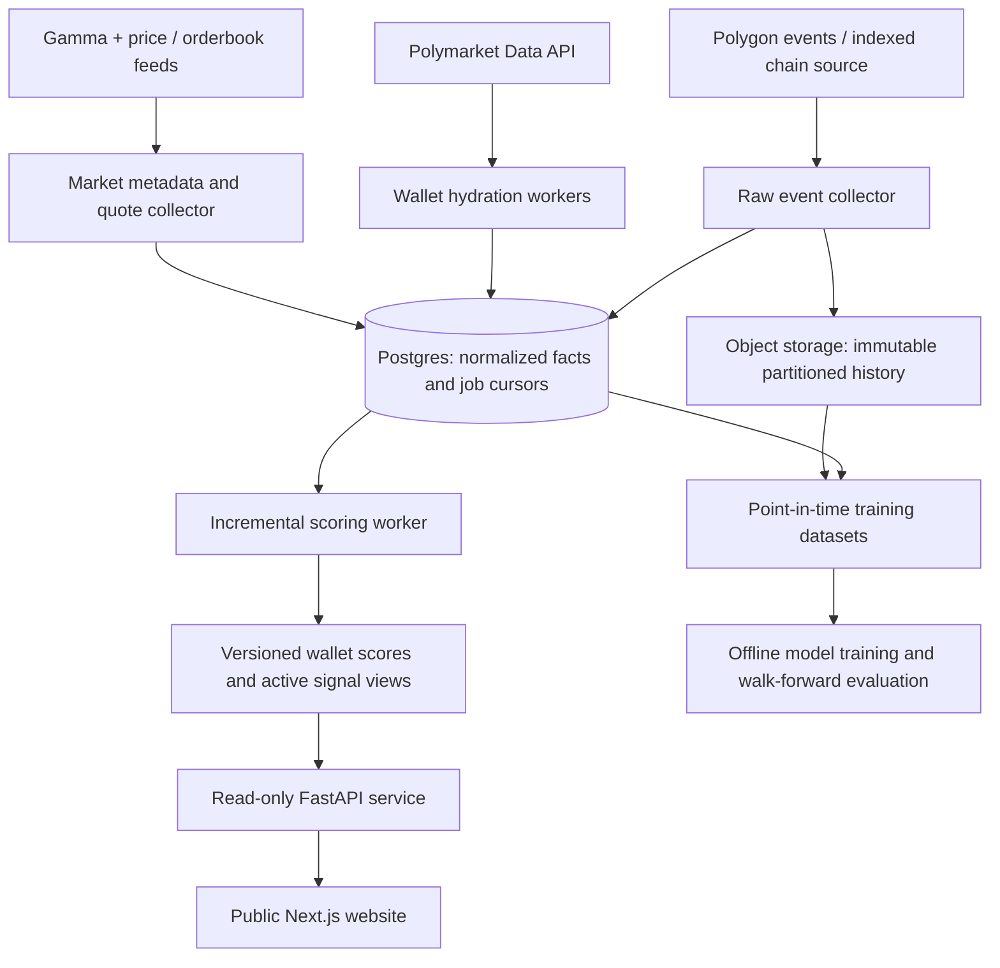

# MarketSignalOS backend platform direction

The product is a public research service: discover Polymarket accounts, measure
their forecasting and economic performance against a price-based baseline, and
show which positions they still hold. Collection, storage, scoring and serving
belong in the cloud. Machine learning is a later consumer of the collected data.

An account can show evidence of skill without identifying the person behind it
or proving why it performed well. Use “historical edge” and “systematic trading
patterns.” Account skill probability is not the probability that its next trade
wins. The product should not claim to have identified insiders.

## Repository assessment

| Capability | Current implementation | Gap to the intended platform |
|---|---|---|
| Discovery | Leaderboard sweeps plus recent orderbook-subgraph traders | Bounded samples; no durable cursor covering all recent chain events |
| History | Wallet activity, positions, hydration coverage and price snapshots | API pagination limits, growing file scans, no complete raw-event archive |
| Scoring | Entry-price Bayesian edge, event grouping, recency, economics, CLV | Population selection correction and prospective validation |
| Public product | Wallet ranking, open positions, dossiers, signal ledger and exits | Historical score versions and stronger cohort/evaluation explanations |
| Hosting | Prepared Railway API + website, volume, scheduler, operator access | Live provisioning and operational measurement still pending |
| Database | Existing Postgres mirror and migrations | API and scoring still consume JSONL; not a database-backed read platform |
| ML | Several useful derived histories exist | Point-in-time features, immutable datasets and chronological evaluation |

## Target architecture

Postgres should first provide durable job state and indexed serving queries.
Use a jobs table with leases/retries before introducing a message broker. Raw
history belongs in compressed object-storage partitions rather than indefinitely
growing application files. Derived scores are reproducible and replaceable;
raw observations and their timestamps are not.

## 1. Run the existing product independently of the laptop

Use [the Railway deployment package](railway-deployment.md). This pilot retains
the current single-process architecture and bounded discovery, with public reads,
private operator controls, persistent run receipts, freshness reporting and
visible sample-coverage wording. It does not implement the target diagram yet.

Acceptance: restart and backup-restore tests pass; real cloud ingestion works
with the laptop off; incomplete history remains quarantined; no public visitor
can launch a rebuild or webhook delivery.

## 2. Make Postgres authoritative before splitting services

Replace JSONL reads in the feed, leaderboard, wallet dossier, scoring, ledger,
exits and notification watermarks. Convert dual writes into transactional
database writes with stable unique keys. Migrate existing local data in batches
and reconcile per-table row counts, representative wallets, balances and scores.

Persist job leases, run IDs, cursors, attempts and completion state. Separate
the API and ingestion worker only after both read the same authoritative database.
Use one scoring job per affected wallet/event and update only changed aggregates.
Publish a completed score/snapshot version atomically so a reader never joins
half-old and half-new materialized results. Add indexed pagination rather than
loading whole histories for every request.

Suggested additions alongside the existing tables:

| Table or dataset | Key data |
|---|---|
| `ingestion_jobs` | Source, cursor, lease owner/expiry, attempts, next retry |
| `raw_chain_events` | Chain ID, block number/hash, tx hash, log index, contract, payload, canonical flag |
| `source_observations` | Endpoint/request scope, event time, observed time, schema version, raw-object reference |
| `wallet_score_versions` | Wallet, as-of cutoff, model version, inputs version, cohort ID, scores and exclusion reasons |
| `evaluation_cohorts` | Discovery rule, all tested wallets, cutoff, correction method, train/test intervals |
| `feature_snapshots` | Wallet/market, feature version, as-of and availability timestamps, label availability |

Acceptance: API operates with its JSONL directory absent; a killed worker
restarts without duplicates or skipped committed work; query latency and worker
peak memory meet measured budgets on a representative dataset.

## 3. Collect recent blockchain history with measurable coverage

Start with a declared recent interval (for example, 30 days), then extend it to
90 days after measuring cost and backlog. Maintain a forward collector and a
separate backfill queue so historical work cannot starve current positions.
“As much as possible” should be reported as covered block intervals, backlog,
source lag, failed ranges and wallet hydration completion.

Polymarket documents on-chain data providers as well as its own APIs. Evaluate
a managed indexed source against a direct Polygon RPC log collector using the
same small block interval and reconciliation criteria. This is a future source
selection, not an installed or purchased provider.
[Polymarket data resources](https://docs.polymarket.com/resources/blockchain-data).

Before implementing decoding, verify current and historical contract addresses,
deployment intervals, ABIs and collateral decimals. Current documentation lists
both trading contracts and deprecated components, so hard-coding an old exchange
address would not establish current coverage.
[Polymarket contract registry](https://docs.polymarket.com/resources/contracts).

Collection requirements:

- Checkpoint a block range only after all its events commit. Retry bounded
  requests with backoff and store failed ranges for replay.
- Preserve `(chain_id, transaction_hash, log_index)` plus block hash/canonical
  status. Replay an overlap and reconcile reorgs; do not use timestamps alone as
  an event cursor. Validate the provider's pagination at tied boundaries.
- Retain raw events once, then normalize wallet-side flows separately. Reconcile
  maker/taker fill emissions instead of summing all logs as independent volume.
- Include transfers, splits, merges, redemptions, fees, rebates and resolutions
  where needed to reconstruct economic exposure. A fill alone cannot explain
  every position change.
- Keep stable outcome-token/condition/event mappings, including negative-risk
  relationships and source version. Group correlated outcomes during scoring.
- Record event time and collection time. Public orderbook quotes require their
  own collector; a blockchain fill does not reconstruct the historical quote book.
- Treat wallet addresses as observed accounts, not necessarily distinct people.
  Preserve uncertainty around related accounts and mirrored strategies.

Acceptance: a specified block interval replays idempotently; reconciliation
samples agree with source transactions and positions; gaps and unsupported
contracts are visible; discovery includes losing/inactive wallets, not only
leaderboard survivors.

## 4. Establish whether the observed advantage survives selection and costs

For a binary outcome bought at probability-like price `p`, the settlement
residual is `y - p`, where `y` is 0 or 1. A purchase at 0.90 is already priced to
win frequently. A high win rate alone is not evidence of excess return. An
implementable return model must additionally represent stake, exits, fees and
execution conditions; price is a benchmark, not a guaranteed true probability.

The existing Bayesian forecast model is a useful explainable baseline. Its
posterior probability is conditional on its assumptions and sampled data; an
80% threshold does not imply a 20% false-discovery rate across thousands of
screened accounts. Keep estimates separate from a new “validated” designation.

Before granting that designation:

1. Freeze the discovery cohort and include every screened wallet in evaluation,
   not just the winners. Require adequate independent settled events and complete
   history; version the thresholds and exclusion rules.
2. Account for related markets and repeated bets at event level. Use a calibrated
   null simulation or dependence-aware bootstrap with documented assumptions.
3. Correct across the tested cohort using an appropriate multiple-testing or
   posterior expected false-discovery procedure. Report the method and cohort
   size, and assess calibration before presenting adjusted confidence.
4. Freeze scores at a cutoff and measure future outcomes on a later interval.
   Repeatedly looking and selecting requires sequential-testing controls or
   fixed evaluation dates. Do not retune on the final holdout.
5. Evaluate follower returns at first-publication executable prices, including
   fees, spread, liquidity, latency and slippage. Wallet entry performance and
   follower performance must be separate metrics.
6. Report ROI uncertainty, drawdown, calibration, stale/closed positions and
   performance decay. A strategy may be profitable for its originator but
   impossible to follow at the displayed price or size.

Acceptance: reproducible cohort reports, null calibration, versioned corrections
and an untouched prospective evaluation. Until then, display historical edge
estimates rather than asserting population-level statistical significance.

## 5. Learn ML using reproducible historical observations

Start with predicting whether a newly surfaced position outperforms its
publication-time price. Keep the existing deterministic score and a market-price
baseline as comparators. Suitable first experiments are logistic regression or
gradient-boosted trees; a deep model is not required to learn the workflow.

Features can include prior wallet edge and uncertainty, recent CLV, category
experience, activity cadence, position sizing, price drift, liquidity and
time-to-resolution. Compute every feature using data available at the prediction
cutoff. Record when resolutions become known; future PnL, later closing lines,
and the future membership of a winning-wallet cohort cannot enter past features.

Use chronological walk-forward splits with event-group separation and an
appropriate gap for overlapping outcome windows. Compare log loss, Brier score,
calibration and net simulated follower returns. Save dataset hashes, feature
versions, training configuration and model artifacts. Run promising models in
shadow mode before changing public rankings.

Acceptance: a reproducible dataset and training script; no future-data leakage;
documented improvement over both baselines on later unseen periods. Machine
learning remains planned work, as requested, rather than a claim about the
current dashboard.
