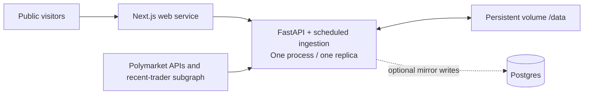

# Railway deployment: public pilot

This is a prepared deployment, not a provisioned or verified live environment.
The user selected Railway and requested preparation before paid provisioning.
No hosting resources, billing settings, domains, or credentials were created.

## Deployable topology

This combined-service preparation predates the $15 target and is not a measured
$15 deployment. The [lean pilot](lean-pilot.md) now has a separate run-once
worker; complete snapshot exchange and serving adapters remain pending. Choose
one ingestion owner per data directory. Do not activate both schedulers or
assume the two services can share a Railway volume.

The variables template now leaves ingestion and fast-lane loops disabled.
Enable a chosen collection path only after measuring its resource requirements;
deploying the prepared API template alone will not collect new data.



Both services run in Railway, so collection and hosting continue with the
developer's computer switched off. The volume is the required durable read/write
store for this pilot. Setting `DATABASE_URL` does **not** make the API read
Postgres, remove JSONL memory costs, or permit independent worker replicas.

Railway volumes persist across deployment, but cannot be shared across services
and do not support replicas. Keep the API and ingestor together until the
database migration described in [platform-roadmap.md](platform-roadmap.md).
See [Railway volume limitations](https://docs.railway.com/volumes).

## Service configuration

| Setting | API / ingestion | Public web |
|---|---|---|
| Repository root | `/` | `/apps/web` |
| Config file | `/railway.toml` | `/apps/web/railway.toml` |
| Start command | `bash scripts/start-api.sh` | `npm run start -- --hostname 0.0.0.0` |
| Health check | `/health` | `/api/health` |
| Replicas | 1, one uvicorn worker | 1 initially |
| Persistent storage | Volume mounted at `/data` | None |
| Variables template | `deploy/railway-api.env.example` | `deploy/railway-web.env.example` |

Use an explicit config-file path: Railway's config file location does not
automatically follow a changed service root. See
[monorepo deployment](https://docs.railway.com/deployments/monorepo) and
[config as code](https://docs.railway.com/config-as-code).

## Provisioning steps, after budget approval

1. Create a Railway project and an API service from this repository. Attach a
   persistent volume at `/data` **before the first running deployment**.
2. Copy the API variables template and supply a randomly generated
   `ADMIN_API_TOKEN` of at least 32 characters through Railway's secret variables.
   Never commit the token or put it in a `NEXT_PUBLIC_*` variable. Railway supplies
   `PORT`, `RAILWAY_ENVIRONMENT_ID`, and `RAILWAY_VOLUME_MOUNT_PATH` itself.
3. Deploy with the root config and generate an HTTPS service domain. Startup
   refuses a missing/short operator token, a data directory outside the Railway
   volume, or more than one configured uvicorn worker.
4. Create the web service from the same repository with root `/apps/web` and the
   explicit config path above. Set `API_BASE_URL` to the API's HTTPS origin.
   This server-only variable is resolved at runtime; the older
   `NEXT_PUBLIC_API_BASE_URL` remains a compatibility fallback.
5. Deploy the web service and generate its public domain. Optionally set that
   origin as `FRONTEND_URL` on the API. Do not enable service sleeping/serverless
   behavior for the API: its scheduler must remain running between visits.
6. Confirm the checks below. New volumes start empty. To retain existing history,
   stop ingestion and transfer the complete existing data directory, including
   checkpoints, sidecar indexes and the watchlist, then restart. Copying a live
   mutable directory can create inconsistent snapshots.

The proposed starting cadence is a shallow refresh every 30 minutes and a deep
pass every fourth successful dispatch (not necessarily every two hours: busy
ticks are skipped). Deep runs hydrate up to 25 wallets per dispatch, with two
concurrent wallet requests and a configured API request rate of three per second.
These are initial limits to measure, not a throughput or total-memory guarantee.
The existing ingestor still scans accumulated files during enrichment.

## Operator controls

Public GET feeds and `/platform/status` require no credentials. All mutation
routes, `/ingestor/status`, `/signals/notifications/status`, and `/metrics`
require `Authorization: Bearer <ADMIN_API_TOKEN>`. Missing configuration disables
operator access; it does not enable anonymous writes. Public frontend builds
hide ingestion buttons, and the frontend proxy forwards only the caller's own
authorization header. It never adds a server-side operator secret.

For example, from an operator terminal with `API_ORIGIN` and `ADMIN_API_TOKEN`
already set privately:

```powershell
$operatorHeaders = @{ Authorization = "Bearer $env:ADMIN_API_TOKEN" }
Invoke-RestMethod -Uri "$env:API_ORIGIN/ingestor/run/deep" -Method Post -Headers $operatorHeaders
Invoke-RestMethod -Uri "$env:API_ORIGIN/ingestor/status" -Headers $operatorHeaders
Invoke-RestMethod -Uri "$env:API_ORIGIN/platform/status"
```

Local development can explicitly set `ALLOW_UNAUTHENTICATED_ADMIN=1` on the API
and `SHOW_INGEST_CONTROLS=1` on the Next.js development server. The auth bypass is
ignored in production and on Railway. Environment templates are examples, not
automatically loaded configuration.

## Deployment acceptance

- API `/health` and web `/api/health` return 200 without contacting upstream APIs.
- Public POSTs to both `/ingestor/run` and the web `/api/ingestor/run` return
  401 when the token is configured; anonymous logs/metrics are also inaccessible.
- The public dashboard and a real wallet dossier load from the cloud API;
  production navigation contains no ingestion controls.
- An authorized initial deep run discovers wallets and writes snapshots. Review
  its summary for partial runs and hydration completeness. Empty or quarantined
  feeds are legitimate; do not substitute fixtures as live results.
- `/platform/status` shows the last non-partial successful run, freshness and
  `coverage=sampled_wallets`. This reports local processing recency; it does not
  prove every wallet or blockchain block is covered.
- Restart the API and verify that the data and run receipt survive. A run marked
  active at restart is recorded as failed rather than left permanently running.
- Observe at least two scheduled runs with the local machine offline. Confirm
  CPU, peak RAM, disk growth, run duration, upstream errors and skipped ticks.
- Enable volume backups and test a restore before relying on the collected
  history. An attached volume by itself is not a backup.

## Costs and rollback

No budget or live cost estimate has been approved. Review Railway's current
plan, compute and storage charges in the project before provisioning. Set an
appropriate usage limit/alert and start with the bounded settings above. Measure
a representative day before expanding discovery depth or hydration batch size.
More RAM in the cloud moves the immediate bottleneck; indexed database reads and
incremental scoring are still needed to reduce it.

To stop collection, set `INGEST_EVERY_MINUTES=0` and redeploy after the active run
has finished. To roll back code, redeploy a prior known-good revision while
retaining `/data`; restore a consistent backup if the data itself is damaged.
Do not attach a second writer or increase API replicas during rollback.

An optional Postgres mirror must be migrated first, using the ingestor package's
`alembic upgrade head` with the same `DATABASE_URL`. There is no reason to pay for
this mirror solely to run the current public pilot. It is not a replacement for
the volume or a complete historical ML archive.
